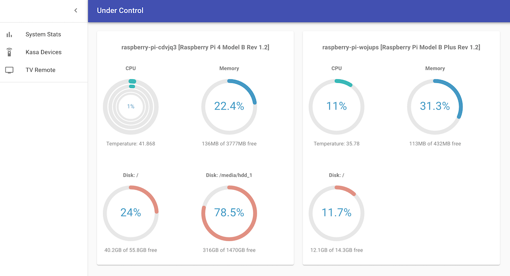

# Under Control UI

A React frontend for the "Under Control" server and system monitor components.

To run the NPM server, use `yarn start`.

## Connecting to the Under Control Server

TODO...

## Connecting to the System Monitor apps



This service connects to the Under Control SysMon apps using [Socket.IO](https://socket.io/) sockets. Since the
hosts/ports will differ, we will hit issues with CORS if the sysmon apps don't allow the cross-origin requests.

Each SysMon app should be configured with the NPM UI server's host/port whitelisted in the `cors_origins` list
(either in the config file or by argument if running directly).

E.g.: The following will allow devices to connect if the NPM server is accessed through localhost, localhost IP or the
host machine IP that the server is running on.

```toml
cors_origins = [
    "http://localhost:3000",
    "http://127.0.0.1:3000",
    "http://192.168.1.123:3000"
]
```

Frustratingly, although FastAPI (the REST frontend for the SysMon apps)
[does support regex patterns for CORS](https://www.starlette.io/middleware/), the Python bindings for SocketIO
[python-socketio](https://python-socketio.readthedocs.io/en/latest/) does not, so we have to configure this manually.

## TODO:

* [ ] Config file [e.g. app urls]
* [ ] Auto-detection of sysmon endpoints
* [ ] Dockerfile
* [ ] TV Remote functions
* [ ] Kasa adaptor frontend

# The standard blurb...

## Getting Started with Create React App

This project was bootstrapped with [Create React App](https://github.com/facebook/create-react-app).

## Available Scripts

In the project directory, you can run:

### `yarn start`

Runs the app in the development mode.\
Open [http://localhost:3000](http://localhost:3000) to view it in the browser.

The page will reload if you make edits.\
You will also see any lint errors in the console.

### `yarn test`

Launches the test runner in the interactive watch mode.\
See the section about [running tests](https://facebook.github.io/create-react-app/docs/running-tests) for more information.

### `yarn build`

Builds the app for production to the `build` folder.\
It correctly bundles React in production mode and optimizes the build for the best performance.

The build is minified and the filenames include the hashes.\
Your app is ready to be deployed!

See the section about [deployment](https://facebook.github.io/create-react-app/docs/deployment) for more information.

### `yarn eject`

**Note: this is a one-way operation. Once you `eject`, you can’t go back!**

If you aren’t satisfied with the build tool and configuration choices, you can `eject` at any time. This command will remove the single build dependency from your project.

Instead, it will copy all the configuration files and the transitive dependencies (webpack, Babel, ESLint, etc) right into your project so you have full control over them. All of the commands except `eject` will still work, but they will point to the copied scripts so you can tweak them. At this point you’re on your own.

You don’t have to ever use `eject`. The curated feature set is suitable for small and middle deployments, and you shouldn’t feel obligated to use this feature. However we understand that this tool wouldn’t be useful if you couldn’t customize it when you are ready for it.

## Learn More

You can learn more in the [Create React App documentation](https://facebook.github.io/create-react-app/docs/getting-started).

To learn React, check out the [React documentation](https://reactjs.org/).
